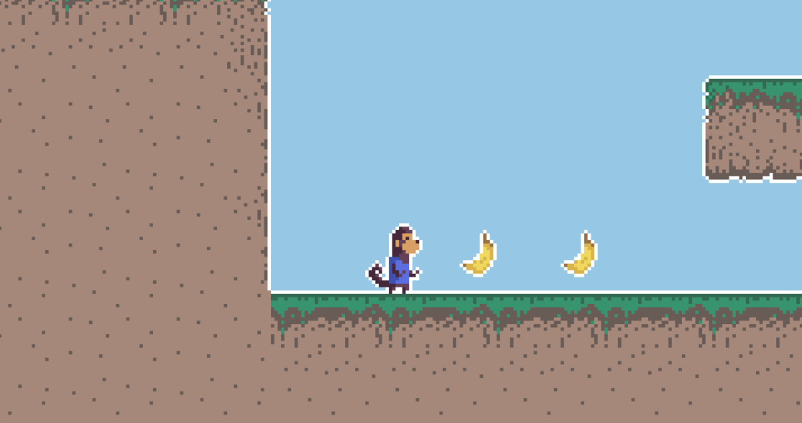

# Monogame.Meetup.Demos

**Slidedeck** : [FR](https://speakerdeck.com/aloisdeniel/monogame-introduction-fr) | [EN](https://speakerdeck.com/aloisdeniel/monogame-introduction-en)

This repository contains a sample game project presented at Meetups.

### Disclaimer

All the content has been created for learning purposes, so **don't expect a production ready engine**. Many optimizations hasn't been included to not over complexify the logic.

## Basic

A basic sample that contains all the game elements.

## ECS

The same game implemented with a basic Entity/Component/System pattern.

## License

MIT © [Aloïs Deniel](http://aloisdeniel.github.io)

